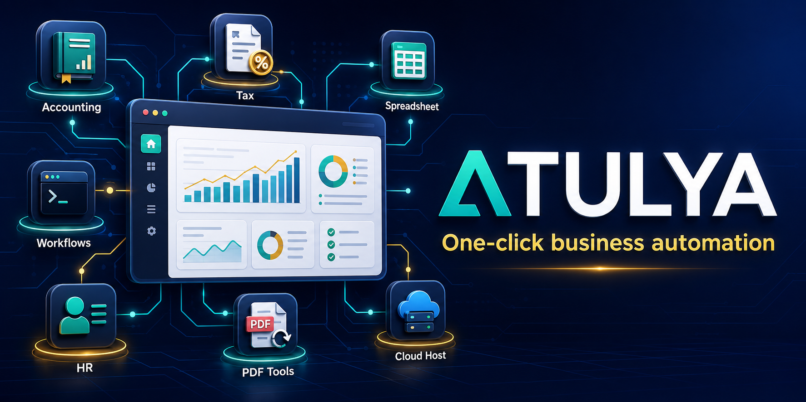
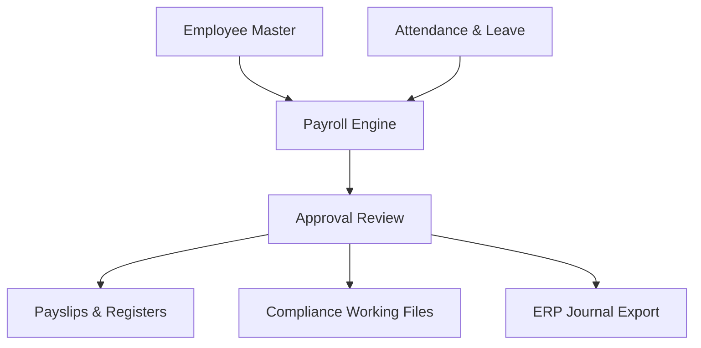

# Atulya HR

> **People, payroll and compliance preparation in one simple workspace.** 👥💼

Atulya HR is planned as a free HR and payroll workflow suite that supports the employee journey from joining to full-and-final settlement, with exports and working files designed for practical business use.

> 🚧 Product roadmap only today. Payroll calculations and statutory outputs must be verified before production use once released.

## 🧑‍💼 Employee Journey

| Stage | Planned tools |
|---|---|
| Recruit and join | Candidate tracker, offer letters, joining checklist and document vault |
| Manage work | Attendance imports, shifts, leave, holidays and approvals |
| Pay | Salary structures, variable pay, deductions, payroll review and payslips |
| Prepare compliance | PF/ESI/PT/TDS working sheets and permitted export-file generation |
| Exit | Final settlement, relieving letters, assets and clearance checklist |

## ⚡ One-Click Workflows

- Import attendance from Excel or biometric exports.
- Generate payroll review sheet and individual payslip PDFs.
- Fill HR letters from approved templates.
- Export compliance preparation reports for review and submission.
- Feed payroll journals into [Atulya ERP](https://github.com/atulyaai/Atulya-ERP).

## 🏗️ Architecture

## 💻 Planned Setup

Windows `.exe`, macOS `.dmg`, Linux AppImage and Docker-based team deployment; local database by default with encrypted backups and role-based access planned for teams.

## 🗺️ Roadmap

| Phase | Delivery |
|---|---|
| 1 | Employees, documents, attendance import and payslip templates |
| 2 | Leave workflow and payroll preview engine |
| 3 | Statutory preparation reports and export validation |
| 4 | Approvals, audit trail and ERP journal integration |
| 5 | Employee self-service portal and Atulya One integration |

## ⚠️ Compliance Boundary

The product will prepare reviewed reports and supported upload files; it will not bypass employer portal authentication, authorizations, OTPs, payments or filing responsibilities.

## 🔗 Ecosystem

[Atulya ERP](https://github.com/atulyaai/Atulya-ERP) · [Atulya Office](https://github.com/atulyaai/Atulya-Office) · [Atulya DataClean](https://github.com/atulyaai/Atulya-DataClean) · [Atulya One](https://github.com/atulyaai/Atulya-One)

## 📜 License

MIT planned for the open-source core.
